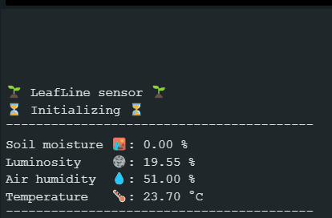

# 🌿 LeafLine IoT Project 🌿

 

## 🔬 Description

Bienvenue dans la partie IoT du projet LeafLine !

Avec l'aide du kit <b>ELEGOO UNO R3</b>, nous surveillons et  recueillons des informations vitales pour la croissance des plantes.

## 🌱 Capteurs Utilisés

- 🌡️ **DHT11** : Mesure la température et l'humidité de l'air.
- 🌞 **DollaTek 5516 Photorésistance** : Permet de surveiller la luminosité ambiante.
- 🌧️ **SparkFun Soil Moisture Sensor** : Détecte l'humidité du sol pour garantir que les plantes sont bien arrosées.

### 📌 Capteurs à venir :

- 📡 **Hailege ESP32 ESP-32S ESP-WROOM-32** : Notre carte Wi-Fi pour connecter notre projet à Internet.
- 🖥️ **LCD-1602A** : Ecran LCD pour afficher les données en temps réel.

## 🔧 Configuration matérielle

- **Kit ELEGOO UNO R3** : Le cœur de notre système IoT, traitant les données des capteurs et communiquant avec le serveur.

## 📚 Bibliothèques utilisées

`#include "LiquidCrystal.h"` ➤ Pour l'affichage sur écran LCD 
`#include "Measurement.h"` ➤ Une classe personnalisée pour gérer et traiter les données des capteurs 
`#include <WiFiEsp.h> ` ➤ Gère la connectivité Wi-Fi de l'Arduino 
`#include <DHT.h>` ➤ Pour le capteur DHT11 

## 💻 Langage de programmation

Utilisation de **C++ Arduino** pour programmer et gérer le dispositif IoT.
